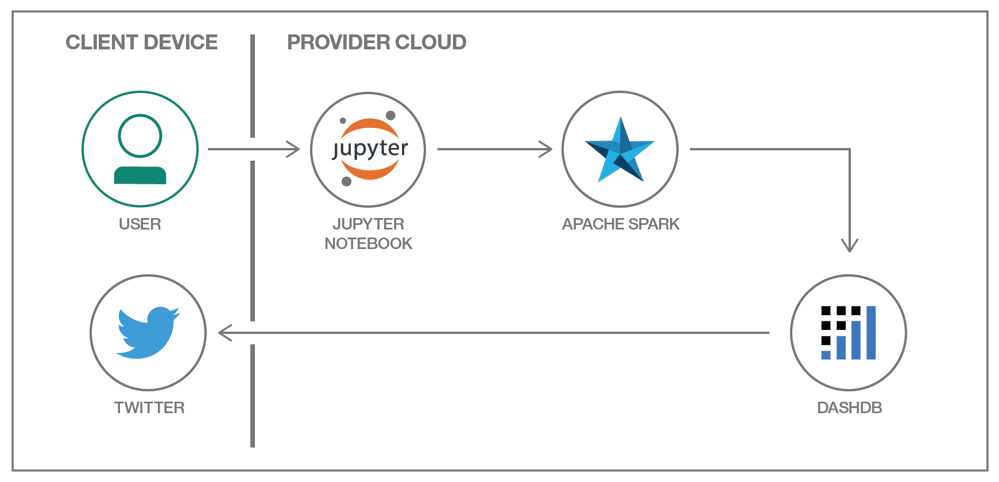
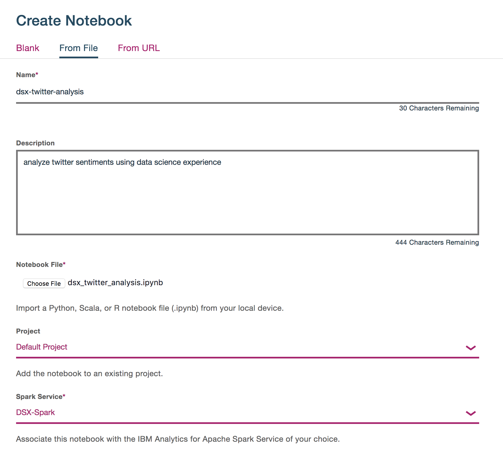
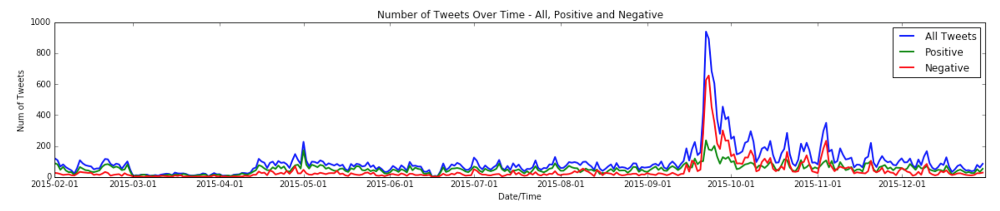
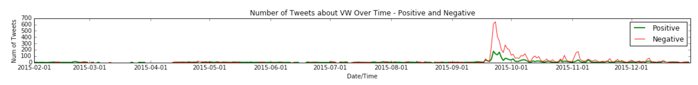
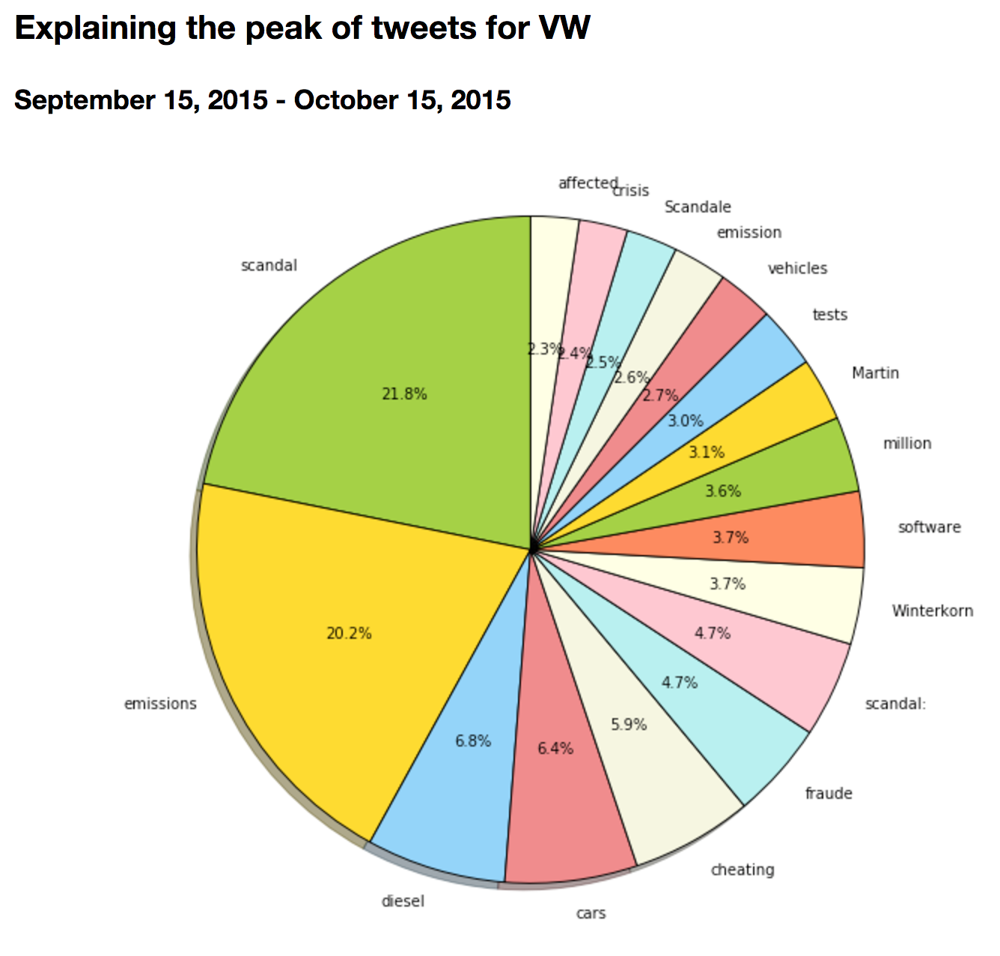
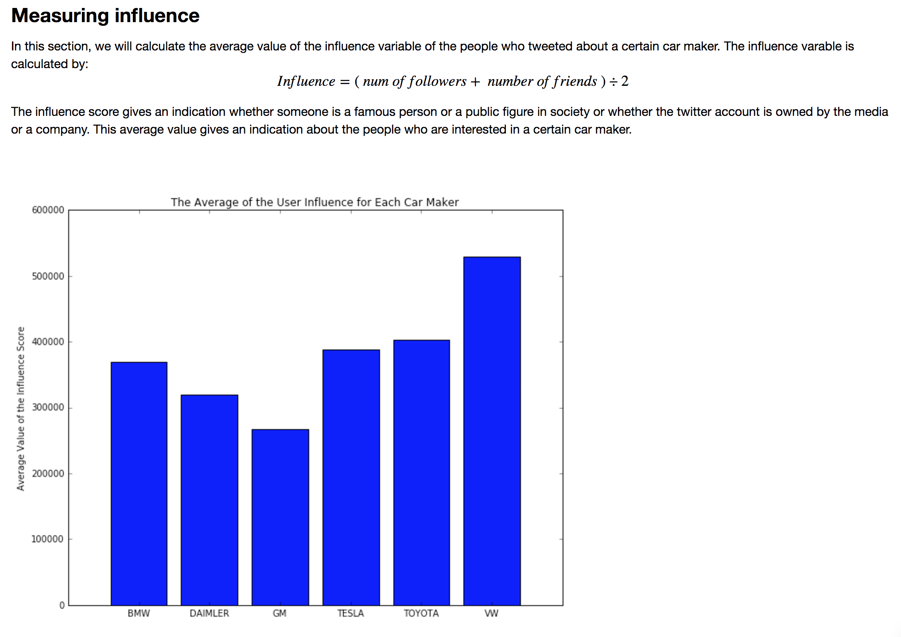
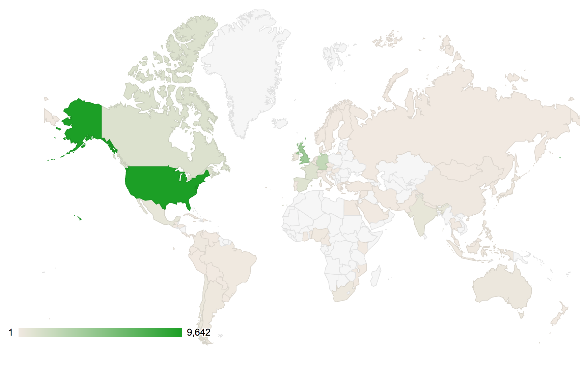
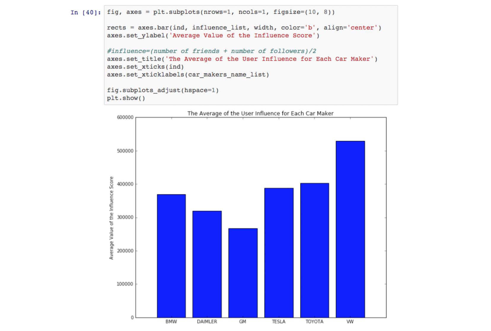

[](https://travis-ci.org/IBM/dsx-twitter-auto-analysis)

# Twitter Analysis with Jupyter Notebooks

In this developer journey we will use Jupyter notebooks to analyze Twitter
data and extract interesting insights from tweets. It will easily perform
complex computations on a large amount of data in a notebook by using
SparkContext, which enables you to run tasks on the Spark cluster. In
addition, it will integrate data from dashDB using the Spark connector
and use Spark and pandas DataFrames.

When the reader has completed this journey, they will understand how to:

* Create a dashDB warehouse containing Twitter data that includes advanced
  enrichments like sentiment, gender and location.
* Transform the data using Python code with Apache Spark and pandas data
  frames.
* Create visualizations using Matplotlib and Google GeoChart.
* Share notebooks and results.

The intended audience for this journey is application developers who need
to efficiently build powerful data visualizations, but who may not have
an abundance of time, data science experience or a dedicated data science
team who could take ownership of such an effort.



## Included Components

* IBM Data Science Experience
* Bluemix Insights for Twitter
* Bluemix dashDB for Analytics
* Bluemix Analytics for Apache Spark
* Jupyter Notebooks
* Python
* pandas (Python Data Analysis Library)
* NumPy
* Wordcloud
* Matplotlib
* Google GeoChart

# Steps

Follow these steps to setup and run this developer journey. The steps are
described in detail below.

1. [Sign up for the Data Science Experience](#1-sign-up-for-the-data-science-experience)
2. [Create Bluemix services](#2-create-bluemix-services)
3. [Configure dashDB](#3-configure-dashdb)
4. [Create the notebook](#4-create-the-notebook)
5. [Run the notebook](#5-run-the-notebook)
6. [Analyze the results](#6-analyze-the-results)
7. [Save and Share](#7-save-and-share)

## 1. Sign up for the Data Science Experience

Sign up for IBM's [Data Science Experience](http://datascience.ibm.com/). By signing up for the Data Science Experience, two services: ``DSX-Spark`` and ``DSX-ObjectStore`` will be created in your Bluemix account.

## 2. Create Bluemix services

Create the following Bluemix services by clicking the **Deploy to Bluemix**
button or by following the links to use the Bluemix UI and create them.

  * [**Insights for Twitter**](https://console.ng.bluemix.net/catalog/services/insights-for-twitter)
  * [**dashDB for Analytics**](https://console.ng.bluemix.net/catalog/services/dashdb-for-analytics)
  
[](https://bluemix.net/deploy?repository=https://github.com/ibm/dsx-twitter-auto-analysis&cm_mmc=github-code-_-native-_-tweetswjn-_-deploy2bluemix)

## 3. Configure dashDB

The first step in the analysis process is to harvest the Twitter data. In
this sample, we use the dashDB connector to the IBM Insights for Twitter
service to seamlessly specify a filter query (tweets about the six leading
car manufacturers in 2015) and load the results into dashDB. This specific
time frame and filter are being used to demonstrate analysis of a known
Twitter spike.

* Launch the dashDB, from the menu on the left, choose ``Load`` and select
  ``Load Twitter Data``. This is a five step process outlined below.

* **Connect to Twitter**: Select the existing **dashDB** service you created
  earlier (if you used the **Deploy to Bluemix** button it is named
  "dtaa-dashdb-service").


* **Search**: In the Search for Twitter data box, enter the query below and
  retrieve a sampling of tweets.

  ```
  posted:2015-01-01,2015-12-31 followers_count:2000 listed_count:1000 (volkswagen OR vw OR toyota OR daimler OR mercedes OR bmw OR gm OR "general motors" OR tesla)
  ```


* **Select table**: In the *Load the data into new tables with this prefix*
  field, enter any text you wish for a namespace.


* **Load data**: This step can take up to 20 minutes, dashDB shows you
  progress as the tweets load.


* **Load complete**: Peruse the reports that dashDB shows.


## 4. Create the notebook

Use the menu on the left to select `My Projects` and then `Default Project`.
Click on `Add notebooks` (upper right) to create a notebook.

* Select the `From URL` tab.
* Enter a name for the notebook.
* Optionally, enter a description for the notebook.
* Enter this Notebook URL: https://github.com/IBM/dsx-twitter-auto-analysis/blob/master/notebooks/dsx_twitter_auto_analysis.ipynb
* Use the `Spark Service` pulldown to select your `DSX-Spark` service.
* Click the `Create Notebook` button.



## 5. Run the notebook

At the top of the notebook, provide your dashDB info.

* Make sure you update `SCHEMA` and `PREFIX` with values you set when importing
  Twitter data into dashDB.
* Use the `username`, `password`, and `jdbcurl` from the dashDB
  `Service Credentials` tab in BlueMix.


*NOTE:* You may have to create your own credentials using the `New Credential` option.

When a notebook is executed, what is actually happening is that each code cell in
the notebook is executed, in order, from top to bottom.

Each code cell is selectable and is preceded by a tag in the left margin. The tag
format is `In [x]:`. Depending on the state of the notebook, the `x` can be:

* A blank, this indicates that the cell has never been executed.
* A number, this number represents the relative order this code step was executed.
* A `*`, this indicates that the cell is currently executing.

There are several ways to execute the code cells in your notebook:

* One cell at a time.
  * Select the cell, and then press the `Play` button in the toolbar.
* Batch mode, in sequential order.
  * From the `Cell` menu bar, there are several options available. For example, you
    can `Run All` cells in your notebook, or you can `Run All Below`, that will
    start executing from the first cell under the currently selected cell, and then
    continue executing all cells that follow.
* At a scheduled time.
  * Press the `Schedule` button located in the top right section of your notebook
    panel. Here you can schedule your notebook to be executed once at some future
    time, or repeatedly at your specified interval.

## 6. Analyze the results

The result of running the notebook is a report which may be shared with or
without sharing the code. You can share the code for an audience that wants
to see how you came your conclusions. The text, code and output/charts are
combined in a single web page. For an audience that does not want to see the
code, you can share a web page that only shows text and output/charts.

The charts produced in the journey clearly demonstrate the following:

* There was a significant negative peak in tweets about car manufacturers
  during the period 2015-09-15 to 2015-10-15.



* This spike was clearly dominated by tweets about the Volkswagen emissions
  scandal.





* The amount of Twitter influence was slightly higher for Volkswagen than
  other car manufacturers.



* The origin of the Volkswagen tweets was significantly from the United
  States and Europe.



* The gender of the tweeters for Volkswagen (and all car makers) was
  significantly unknown. If we were to assume that the known-gender tweets
  are a good representative, then we could say predominantly male.


## 7. Save and Share

### How to save your work:

Under the `File` menu, there are several ways to save your notebook:

* `Save` will simply save the current state of your notebook, without any version
  information.
* `Save Version` will save your current state of your notebook with a version tag
  that contains a date and time stamp. Up to 10 versions of your notebook can be
  saved, each one retrievable by selecting the `Revert To Version` menu item.

### How to share your work:

You can share your notebook by selecting the “Share” button located in the top
right section of your notebook panel. The end result of this action will be a URL
link that will display a “read-only” version of your notebook. You have several
options to specify exactly what you want shared from your notebook:

* `Only text and output`: will remove all code cells from the notebook view.
* `All content excluding sensitive code cells`:  will remove any code cells
  that contain a *sensitive* tag. For example, `# @hidden_cell` is used to protect
  your dashDB credentials from being shared.
* `All content, including code`: displays the notebook as is.
* A variety of `download as` options are also available in the menu.

# Sample output

The following is a sample data visualization with code:



For a full example without code see [`data/examples/sample_output.pdf`](data/examples/sample_output.pdf).

# Troubleshooting

[See DEBUGGING.md.](DEBUGGING.md)

# License

[Apache 2.0](LICENSE)
