# Twitter Data Sentiment Analysis

Twitter tweets are an attractive data source to analyze
as Twitter users tweet about many different topics in which
they not only impart knowledge to others but also express
their feelings and opinions. Analyzing this data can result
in valuable insights and can be useful to detect trends and
drive business decisions. Notebooks are a powerful platform
for data scientists to analyze Twitter data.

## Auto Industry Tweets

This notebook analyzes Twitter data to glean insights about
the automotive industry. As the automotive industry is one of
the largest industries in the world and still very much a growth
industry, analyzing tweets about cars can assist manufacturers
to pay closer attention to market dynamics and position their
companies to take advantage of demographic changes and shifts
in consumer expectations.

## Learning goals

The notebook is structured into different sections. In the first
sections, you will perform a general analysis on the data set then
you will go deeper in the analysis to gain meaningful insights
about manufacturers.

1. Determine the countries with the highest number of tweets
   (based on the user profile information).

2. Analyze tweet sentiments

3. Draw insights from tweets about major car manufacturers worldwide
   by combining Twitter timeline analysis with sentiment, gender
   distribution and location distribution.

## The data set

    Number of tweets: 127898
    Number of sentiment records: 41280
    Aggregated tweets with sentiment scores: 31877

## Distribution of tweets by country

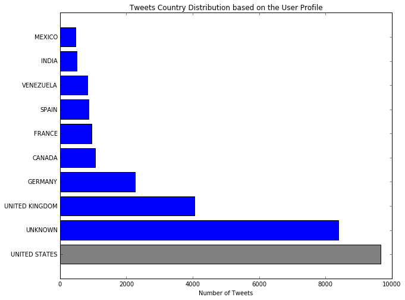

%%html

    <IPython.core.display.Javascript object>

## Analyzing tweet sentiments

Sentiment analysis is one of the most valuable sources of information
that the IBM twitter API provides. By giving each tweet a sentiment
value, you can determine whether the content of a tweet is positive,
negative, ambivalent, neutral, or NULL, if no value is provided by
the API. Unfortunately, a sentiment value is provided for English,
German, French, and Spanish tweets only. As the data set also has tweets
in other languages, only a subset of the tweets in the data set have
a sentiment value.

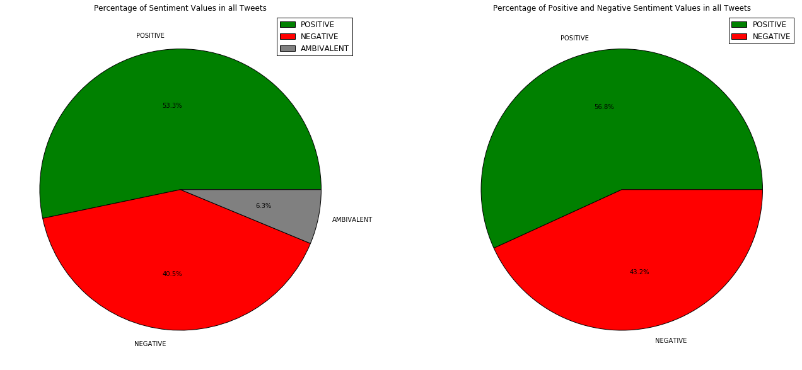

## Analyzing tweet timelines

To learn more about which car manufacturing events occurred in 2015, you can
plot data over time. The following section groups all tweets created in 2015
by their posting date (and sentiment value) and counts the number of tweets
per date.

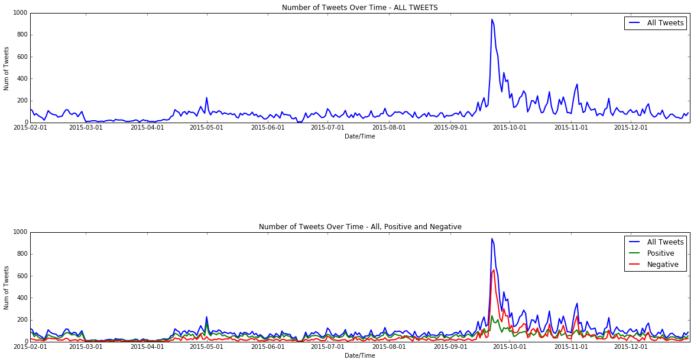

## Insights from tweets about car manufacturers

This section combines different types of analyses to dig deeper
into the list of car manufacturers (Volkswagen, Toyota, BMW,
Daimler, and  General Motors). The purpose of the analyses is to
obtain car manufacturer-based insights from tweets that could be
interesting and useful to detect potential car buyers. The first
step is to detect the tweets that mention certain car manufacturers.

## Analyzing tweet timelines by car maker

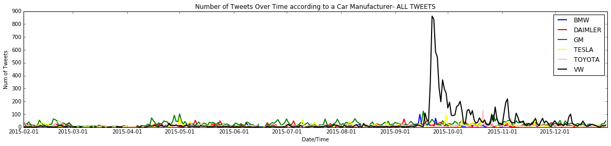

## Explaining the peak of tweets for VW
### September 15, 2015 - October 15, 2015

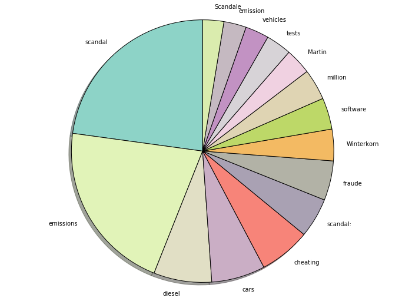

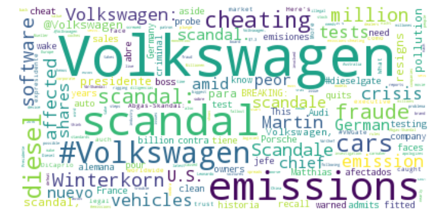

## Sentiment analysis by car maker

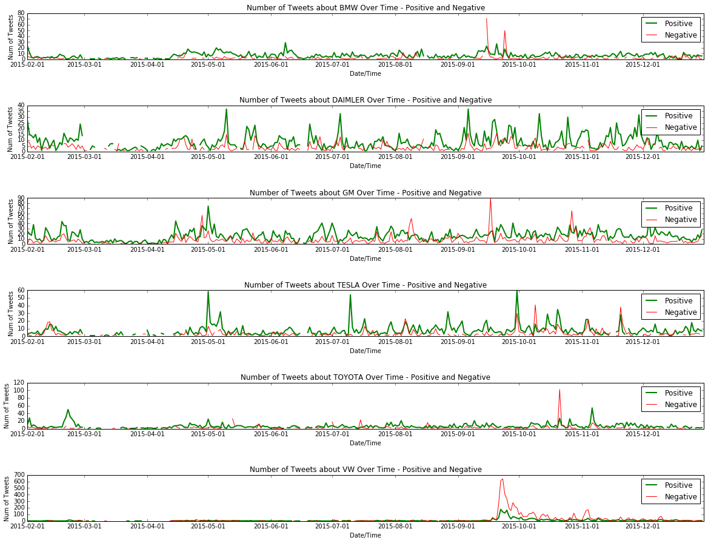

## Tweet distribution by car manufacturer

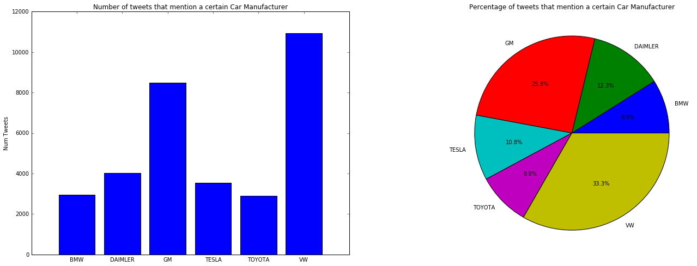

## Tweet distribution by sentiment by car maker

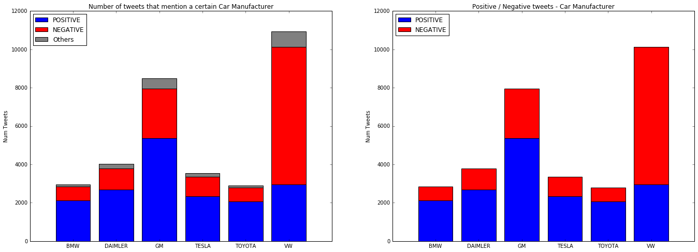

## Gender distribution

Another interesting insight when analyzing tweets about certain
car manufacturers and what car manufacturers might want to pay
more attention to for marketing purposes is the distribution of
tweets between male and female users.

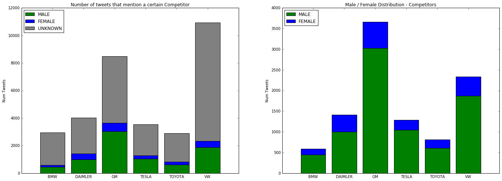

## Measuring influence

In this section, we will calculate the average value of the influence
variable of the people who tweeted about a certain car maker. The
influence varable is calculated by:

$$Influence = ( \space num \space of \space followers +
\space number \space of \space friends \space ) \div 2$$

The influence score gives an indication whether someone is a famous
person or a public figure in society or whether the twitter account
is owned by the media or a company. This average value gives an
indication about the people who are interested in a certain car maker.

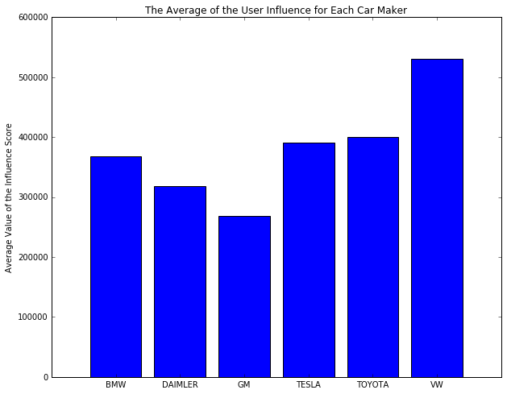

## Distribution of tweets by country across car manufacturer

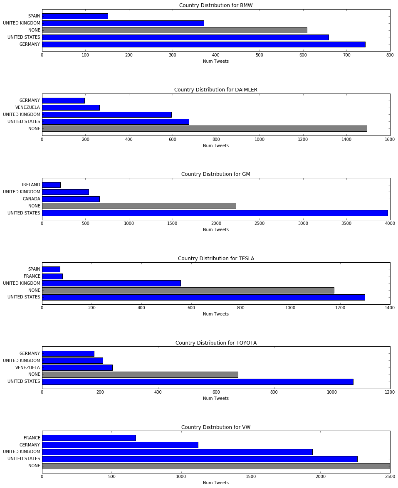

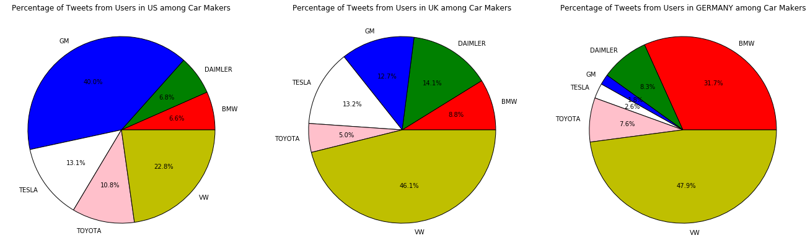

# Summary
In this notebook you learned how to use notebooks to analyze Twitter
data and extract interesting insights from tweets. You learned how to
easily perform complex computations on a large amount of data in a
notebook by using SparkContext, which enables you to start tasks on the
Spark cluster. In addition, you learned how to integrate data from dashDB
using the Spark connector and how to use Spark and pandas DataFrames.
